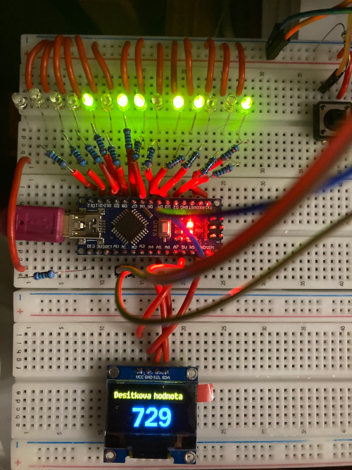

# 14bit decimal to binary converter

Převodník mezi desítkovou a dvojkovou soustavou. Desítková čísla zobrazuje na displeji, dvojková pomocí řady diod.

Na piny D0 až D13 připojíme 14 LED (přes přiměřený rezistor), na piny A1 a A2 tlačítka zapojená jako pull down, OLED displej na piny A4 (SDA) a A5 (SCL).
Jedno tlačítko funguje pro navyšování čísla, druhé pro zmenšování čísla. LED diody v řadě za sebou (D13 D12 ... D0) vyjadřují dvojkové číslo.

